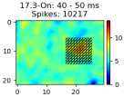
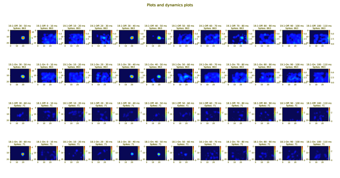
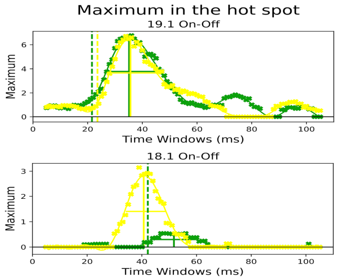
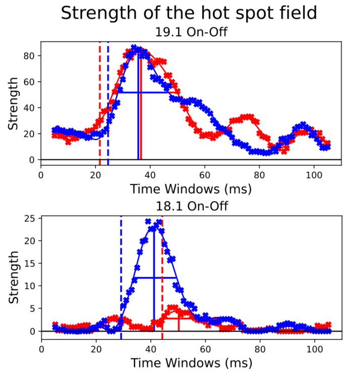

# MaximumStrength 

MaximumStrength is a script used to assess temporal dynamics of receptive
fields (RF) and magnitude of the response to sparse noise stimulation.
The maximum values (the pixel with largest response) and peak strength
(power, all contiguous spatial position in this spatial RF) dynamics are used.
Temporal dynamics of the RF maps were generated by using a sliding time window
with a chosen step and duration. The dynamics of average spatial responses at
each time delay was fit with a polynomial function. From these fits next
parameters can be extracted: latency of visual response (defined as the time
at which the variance first crosses the three times SD above the mean variance
of noise at delay 0–15 ms after stimulus onset), peak latency of the response
(measured as the time at which the interpolating function reached maximum
value), duration of the response (defined as the full width of the
interpolating function at half maximum value), and Sign index that
indicate the ON or OFF subfield dominance. 

## Installation

We need python-language and a few additional modules (packages) to run our
scripts. To get more information about python visit web-sites:
https://www.python.org/. Please keepin mind that the newest versions of python
won't work with old operating systems as Windows 7, Windowx XP etc. So please
pay attention what you download and install. Please read documentation to
install, delete or update Python-language and packages.

Install latest version of python for all user. Install it for all users. For
Windows 7 it will be vesrion 3.8.10 and for Windows 10 or 11 it will be version
3.13.0 or later. To install scikit-learn package we have to install Microsoft
Visual Studio. The latest Community-version will be good. We need only desktop
application support in Visual Studio. Upgrade pip and install packages. 

Check the "import" statements in all *.py files to know what modules do we have
to install. "import" statements are also used for using standard python
modules. No need to install them. A error message after running scripts could
say what module is missed. 

**Example 1.1. Install packages:**

*pip install --upgrade matplotlib\
pip install --upgrade numpy\
pip install --upgrade pycodestyle\
pip install --upgrade PyQt6\
pip install --upgrade scikit-learn\
pip install --upgrade scipy\
pip install --upgrade tabulate*              

**Example 1.2. Update packages:**

*python -m pip install --upgrade pip\
pip freeze > list.txt\
pip install -r list.txt --upgrade*
                
## Configuration parameters
### Main configuration parameters

<table align="left">
    <tr>
        <th>Parameter</th>
        <th>Description</th> 
    </tr>
    <tr>
        <td><i>InputDir</i></td> 
	    <td>- directory with data files. Default value: 'Data'.</td>
    </tr>
     <tr>
        <td><i>OutputDir</i></td> 
	    <td>- directory to save results: report and graphics files. The default
        value: 'Output\MaximumStrength'.</td>
    </tr>
     <tr>
        <td><i>BasicFileName</i></td> 
	    <td>- filename without extension (it hat to match the exact filename in
        InputDir). The same filename will be used for data and result files.
        This parameter has to be changed before script running.</td>
    </tr>
    <tr>
        <td><i>PLXFileName, LogFileName, PlotGraphicFileName</i></td> 
	    <td>- data, report and colormap plot graphics filenames are generated
        automatically and can be edited by user.</td>
    </tr>
    <tr>
        <td><i>HotSpotMaximumFittingCurveGraphicFileName,
        PowerFittingCurveGraphicFileName</i></td> 
	    <td>- file names for hotspot and power fitting curves.</td>
    </tr>
    <tr>
        <td><i>ProtocolNumber</i></td> 
	    <td>- protocol for encoding information for visual stimulation.
        Default value: 11. To analize old data use protocol 0 (obsolete, no
        longer supported). Other protocol could be used.</td>
    </tr>
     <tr>
        <td><i>VRR</i></td> 
	    <td>- vertical refresh rate (in Hz) of the stimulation computer
        monitor. Default value is 160.</td>
    </tr>
     <tr>
        <td><i>VRR_AutoDetectFlag</i></td> 
	    <td>- parameter defines the mode of VRR detection: autodetect or preset
        value. The script detects only 100 or 160 Hz in automatic mode. For
        other values preset VRR and reset this flag. The value range: True or
        False.</td>
    </tr>
     <tr>
        <td><i>PlexonDigitalCard</i></td> 
	    <td>- digital input of Plexon hardware (TTL). Default value: 0. The
        value range: 0 or 1. 0 - primary stimualtion, 1 - secondary
        stimulation.</td>
    </tr>
     <tr>
        <td><i>FileInterval</i></td> 
	    <td>- parameter selects the time window in seconds for data analysis.
        If it is not preset (None, None) uses an entire file for analysis.</td>
    </tr>
    <tr>
        <td><i>Filter</i></td> 
	    <td>- parameter for filter. This filter will be applied to the raw data
        matrix. The value range: 'gaussian' or None. None means the unfiltered
        raw data matrix will be used.</td>
    </tr>
    <tr>
        <td><i>GaussianSigma</i></td> 
	    <td>- parameter for the Gaussian filter. The role of sigma is to
        control the variation around its mean value. A higher Sigma allows for
        more variance around the mean, resulting in a larger and smoother RF.
        </td>
    </tr>
    <tr>
        <td><i>Interpolation</i></td> 
	    <td>- smoothing method used for presentation of the colormap plot.
        Default value: 'bicubic'. Read Matplotlib documentation for all
        possible values.</td>
    </tr>
    <tr>
        <td><i>TimeWindows: T1, T2, Step, Duration</i></td>  
	    <td>- T1 - T2 - time interval for dynamics in ms. Step - the time
        interval in ms between two iterations. The duration is the time window
        of analysis in ms.</td>
    </tr>
    <tr>
        <td><i>PlotStep</i></td> 
	    <td>- parameter specifies how many spatial RF maps will be presented in
        output file for visualization, for example every 10 ms.</td> 
    </tr>
    <tr>
        <td><i>OriginalMaximShow</i></td> 
	    <td>- show/hide maximum values of plots before. The value range: True
        or False.</td> 
    </tr>
    <tr>
        <td><i>ModifiedMaximShow</i></td> 
	    <td>- show/hide maximum values of plots after. The value range: True or
        False.<td> 
    </tr>
    <tr>
        <td><i>MainPlotMode</i></td> 
	    <td>- parameter defines what normalization of the maximum is used for
        visualization of the Main plots. The value range: 'None' or 'vertical'.
        None - each plot uses its own maximum; 'vertical' plots are normalized
        to the maximum ON and OFF responses for all channels. Used for
        comparison of the strength of the hotspot of ON and OFF subfields.</td> 
    </tr>
    <tr>
        <td><i>DynamicsPlotMode</i></td> 
	    <td>- parameter defines what normalization of the maximum is used for
        visualization of the Dynamics plots. The value range: 'None',
        'horizontal', 'vertical', 'group'. None - each plot uses its own
        maximum; 'vertical' plots are normalized to the maximum ON- and
        OFF-responses for all channels; 'horizontal' - the maximum for all
        ON-plots and the maximum for all Off-plots; 'group' - the maximum for
        all dynamics plots.</td> 
    </tr>
    <tr>
        <td><i>ShowPlotSubfield: I1, I2, J1, J2</i></td>  
	    <td>- show entire plot or part of plot.</td> 
    </tr>
    <tr>
        <td><i>MaximumFieldShow</i></td> 
	    <td>- show/hide maximum field.</td> 
    </tr>
    <tr>
        <td><i>StdThresholdCoefficient</i></td>  
	    <td>- coefficient (in SD) to multiply base line to calculate the
        latency of the response. Default value: 3.<td> 
    </tr>
    <tr>
        <td><i>PlotAdjustment: Top, Left, Right, Bottom, HSpace, WSpace
        </i></td> 
	    <td>- matplotlib-parameters for grid of subplots, X or Y position of
        top, left, right, bottom subplots, the height and width of the padding
        between subplots. These parameters are applied for plot visualization.
        <td>
    </tr>
    <tr>
        <td><i>CurveAdjustment: Top, Left, Right, Bottom, HSpace, WSpace
        </i></td> 
	    <td>- matplotlib-parameters for grid of subplots, X or Y position of
        top, left, right, bottom subplots, the height and width of the padding
        between subplots. These parameters are applied for fitting curve
        visualization.</td> 
    </tr>
    <tr>
        <td><i>TightLayoutFlag</i></td> 
	    <td>- adjust the padding between and around subplots. The value range:
        True or False.</td>
    </tr>
    <tr>
        <td><i>CurveWindowMaximized</i></td>  
	    <td>- maximized fitting curve window to full screen or not. The value
        range: False or True.</td> 
    </tr>
    <tr>
        <td><i>CurveWindowWidth, CurveWindowHeight</i></td>  
	    <td>- fitting curve window size in inches if window is not maximized to
        full screen.</td> 
    </tr>
    <tr>
        <td><i>FittingCurveHBin</i></td> 
	    <td>- tick step on X-axis.<td> 
    </tr>
    <tr>
        <td><i>LinspacePointNumber</i></td> 
	    <td>- number of pixels in fitting curve.</td> 
    </tr>
    <tr>
        <td><i>HotSpotMaximumFittingCurveColors</i></td>  
	    <td>- colors for On- and Off- hotspot fitting curves.</td> 
    </tr>
    <tr>
        <td><i>PowerFittingCurveColors</i></td>  
	    <td>- colors for On- and Off- power fitting curves.</td> 
    </tr>
    <tr>
        <td><i>PlotGraphicFileDPI, HotSpotMaximumFittingCurveGraphicFileDPI,
        PowerFittingCurveGraphicFileDPI</i></td> 
	    <td>- resolutions for plot, hotspot and power fitting curve graphics
        files.</td>
    </tr>
</table>

### Channel configuration parameters 

<table align="left">
    <tr>
        <th>Parameter</th>
        <th>Description</th> 
    </tr>
    <tr>
        <td><i>Channel</i></td>
	    <td>- Plexon channel. The value range: 1 - 32.</td>   
    </tr>
    <tr>
        <td><i>Cluster</i></td>
	    <td>- Plexon cluster. The value range: 1 - 4.</td>   
    </tr>
    <tr>
        <td><i>Treshold</i></td>
	    <td>- parameter specifies the threshold to remove noise and get clear
        RF. Defaut value: 0.3. The value range: 0 - 1.</td>   
    </tr>
    <tr>
        <td><i>TimeWindowPlotMode</i></td>
	    <td>- The parameter defines the time window for channel. The value
        range: 'On', 'Off', 'OnOff'. 'On' - the time window from 'On'-plot
        parameters is used for On- and Off-plots. 'Off' - the time window from
        'Off'-plot parameters is used for On- and Off-plots. 'OnOff' - each
        plot uses its own time window parameter.</td>  
    </tr>
    <tr>
        <td><i>MaximumIJPlotMode</i></td> 
	    <td>- parameter defines the maximum position (IJ) for channel. The
        value range: 'On', 'Off', 'OnOff'. In case 'OnOff' each plot will use
        its own maximum position.</td>
    </tr>
    <tr>
        <td><i>FittingCurve</i></td> 
	    <td>- type of function used for fitting curve. The value range:
        'gaussian', 'polyfit', 'two&lowbar;exponential'.</td>
    </tr>
    <tr>
        <td><i>PolyfitDegree</i></td> 
	    <td>- degree in a polynomial function.</td>    
    </tr>
    <tr>
        <td><i>MinMaxXFit</i></td> 
	    <td>- interval used to calculate mathematical function for best fitting
        curve. Default value: (None, None).</td>
    </tr>
    <tr>
        <td><i>StdLatencyTimeDelay</i></td> 
	    <td>- delay for detecting latency (STD threshold). The value range:
        None or time in ms.</td>
    </tr> 
    <tr>
        <td><i>Response</i></td> 
	    <td>- parameter specifies the polarity of response. The value range:
        'On', 'Off' of 'Merged'. 'Merged' is used for merged on- and off-plots.
        </td>
    </tr> 
    <tr>
        <td><i>TimeWindow</i></td> 
	    <td>- parameter specifies the time window in milliseconds for
        reverse-correlation processing.</td>
    </tr> 
    <tr>
        <td><i>MaximumAutoDetectFlag</i></td> 
	    <td>- parameter allow to detect the position of RF maximum in automatic
        (if 'True') mode or using preset position (if 'False'). The value
        range: True or False.</td>
    </tr> 
    <tr>
        <td><i>IJMaximumPosition</i></td> 
	    <td>- parameter specifies the preset position of RF maximum. The value
        range: ((I1, J1) - (I22, J30)). I, J is the absolute position in data
        matrix.</td>
    </tr> 
    <tr>
        <td><i>FieldRadius</i></td> 
	    <td>- parameter specifies the radius of field around hotspot (maximum
        position). This value is a number of grid squares (elements of
        reverse-correlation matrix): 1 = 3x3, 2 = 5x5, etc.
        </td>
    </tr> 
    <tr>
        <td><i>FieldAddTuple</i></td> 
	    <td>- parameter allows to add grid squares to the field around the
        hopspot. The value range: None or ((I1, J1), (I2, J2), ..., (In, Jn)).
        </td>
    </tr> 
    <tr>
        <td><i>FieldRemoveTuple</i></td> 
	    <td>- parameter allows to remove grid squares from the field aroud the
        hotspot. The value range: None or ((I1, J1), (I2, J2), ..., (In, Jn)).
        </td>
    </tr> 
</table>

### Plot configuration parameters

<table align="left">
    <tr>
        <th>Parameter</th>
        <th>Description</th> 
    </tr>
    <tr>
        <td><i>FittingCurveEnable</i></td>
        <td>- show/hide fitting curve and parameters. The value range: False or
        True.</td>
    </tr>
    <tr>
        <td><i>BaseLineInterval</i></td>
        <td>- interval in ms for the base line. Format: (t1, t2).</td>
    </tr>
</table>

## Data visualization

Here is a visualization of receptive field dynamics plots. 

Here is a visualization of hot spot maximum fitting curves and power fitting
curves. 

<table>
    <tr>
        <td></td>
        <td></td>
    </tr>
</table>

  
## Report 
### MaximumStrength report parameters: 

<table align="left">
    <tr>
        <th>Parameter</th>
        <th>Description</th> 
    </tr>
    <tr>
        <td><i>CH.CL</i></td> 
	    <td>- Channel and cluster number.</td> 
    </tr>
    <tr>
        <td><i>On/Off</i></td> 
	    <td>- On- or Off-response.</td> 
    </tr>
    <tr>
        <td><i>Peak T</i></td> 
	    <td>- time moment in ms of peak for dynamics. Other words it is time
        delay from stimulation to maximal responses.</td> 
    </tr>
    <tr>
        <td><i>Sigma</i></td> 
	    <td>- full width of half height of peak in ms.</td> 
    </tr>
    <tr>
        <td><i>T0</i></td> 
	    <td>- time moment in ms of Sigma.</td> 
    </tr>
    <tr>
        <td><i>R2 %</i></td> 
	    <td>- regression score function or coefficient of determination in
        %.</td> 
    </tr>
    <tr>
        <td><i>Latency</i></td> 
	    <td>- time moment in ms where fitting curve cross the threshold
        (coefficient number of STDs of the baseline noise). Pay attention to
        input parameters: 'StdLatencyTimeDelay' and 'StdThresholdCoefficient'.
        </td>
    </tr>
</table>
 
